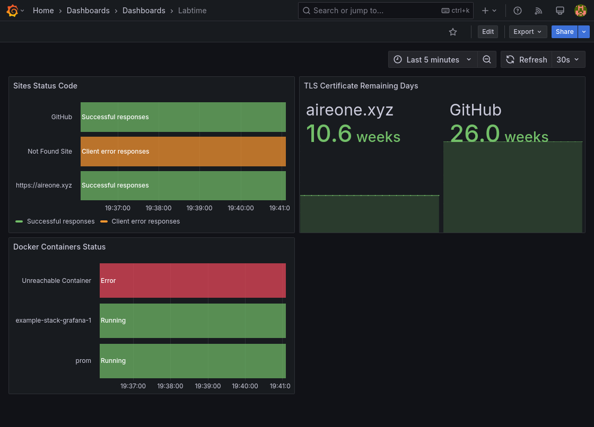
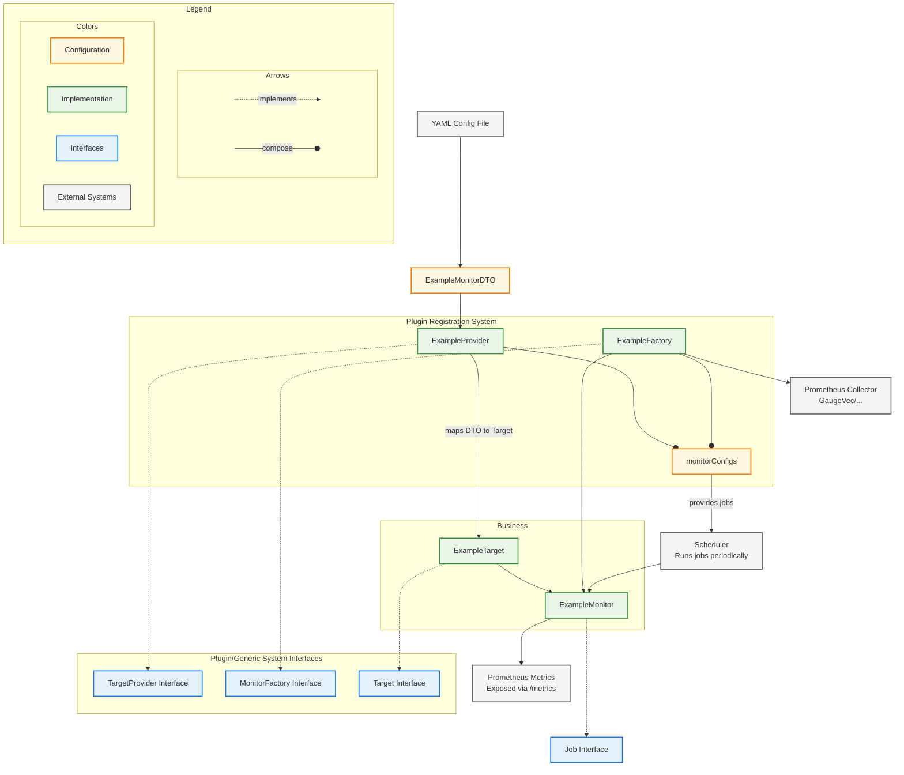

# labtime

An uptime checker for my homelab ⏱️

Labtime is a Go-based monitoring system that checks HTTP endpoints, TLS
certificates, and Docker containers, exposing metrics via Prometheus. Monitors
are configurable via a YAML configuration file with intervals and comprehensive
health checks to integrate with Infrastructure as Code driven homelabs.



## Features

- **HTTP Monitoring**: Check website response codes with configurable HTTP
  methods
- **TLS Certificate Monitoring**: Monitor SSL/TLS certificate expiration dates
- **Docker Container Monitoring**: Track container status
- **Dynamic Docker Monitoring**: Automatically monitor containers with specific labels
- **Prometheus Integration**: Export metrics for monitoring dashboards
- **Configurable Intervals**: Set custom check intervals per monitor
- **Distroless and Rootless Container**: Secure, minimal container image
- **JSON Schema Validation**: JSON schema of the YAML configuration available to
  perform in editor validation

## Usage

Run labtime with a configuration file:

```bash
labtime --config config.yaml
```

### Command Line Flags

- `--config` (or env `CONFIG`): Path to configuration file (default:
  `config.yaml`)
- `--watch` (or env `WATCH`): Watch for changes in the configuration
- `--dynamic-docker-monitoring` (or env `DYNAMIC_DOCKER_MONITORING`): Enable
  dynamic Docker monitoring to automatically monitor containers with specific
  labels

The application serves Prometheus metrics on port `:2112` at the `/metrics`
endpoint (e.g., `http://localhost:2112/metrics`).

### Docker Compose

```yaml
services:
  labtime:
    image: ghcr.io/aire-one/labtime:latest
    ports:
      - 2112:2112
    volumes:
      - ./labtime-config.yaml:/config.yaml:ro
      # For Docker monitoring, the Docker socket needs to be mounted:
      # - /var/run/docker.sock:/var/run/docker.sock:ro
    # May need to run as root for Docker socket access:
    # user: root
    environment:
      # Enable dynamic Docker monitoring (optional)
      # - DYNAMIC_DOCKER_MONITORING=true
```

The container is distroless and runs as a non-root user by default. For Docker
monitoring features (including dynamic monitoring), running with root
privileges may be required.

### Configuration

Create a `config.yaml` file with your monitoring targets:

```yaml
# HTTP Status Code Monitoring
http_status_code:
  - name: "My Website"
    url: "https://example.com"
    method: "HEAD"  # Optional: GET, POST, HEAD, etc. (default: HEAD)
    interval: 60    # Optional: seconds between checks (default: 60)
  - url: "https://api.example.com"  # Name defaults to URL

# TLS Certificate Monitoring
tls_monitors:
  - name: "Main Site"
    domain: "example.com"
    interval: 3600  # Check every hour (default: 60)
  - domain: "api.example.com"  # Name defaults to domain

# Docker Container Monitoring
docker_monitors:
  - name: "web-server"
    container_name: "nginx"
    interval: 30    # Check every 30 seconds (default: 60)
  - container_name: "database"  # Name defaults to container_name
```

Configuration can be validated against the JSON schema in
`labtime-configuration-schema.json` by adding the
`# yaml-language-server: $schema=https://raw.githubusercontent.com/Aire-One/labtime/refs/heads/main/labtime-configuration-schema.json`
comment to the top of the YAML file to enable schema validation in editors that
support it.

### Dynamic Docker Monitoring

Dynamic Docker monitoring enables automatic monitoring of Docker containers
based on labels, without requiring static configuration.

#### Container Labels

Containers must have the following labels to be monitored:

- `labtime=true`: Required label to enable monitoring for the container
- `labtime_interval=<seconds>`: Optional monitoring interval in seconds
  (default: 60)

#### Running Containers with Labels

Run containers with the required labels to enable monitoring:

```bash
# Monitor a container with default 60-second interval
docker run -d --label labtime=true nginx

# Monitor with custom 30-second interval
docker run -d --label labtime=true --label labtime_interval=30 nginx
```

Or in Compose files:

```yaml
services:
  web:
    image: nginx
    labels:
      - labtime=true
      - labtime_interval=30
```

### Environment Variables

| Variable Name | Description | Default |
| ------------- | ----------- | ------- |
| `CONFIG` | Path to the configuration file | `config.yaml` |
| `WATCH` | Watch for changes in the configuration file | `false` |
| `DYNAMIC_DOCKER_MONITORING` | Enable dynamic Docker monitoring | `false` |

## Metrics

Labtime exports the following Prometheus metrics:

- `labtime_http_site_status_code` - HTTP response status codes
  - Labels: `http_monitor_site_name`, `http_site_url`
- `labtime_tls_certificate_expires_time` - TLS certificate expiration timestamp
  - Labels: `tls_monitor_name`, `tls_domain_name`
- `labtime_docker_container_status` - Docker container running status
  (1=running, 0=stopped)
  - Labels: `docker_monitor_name`, `docker_container_name`

## Development

### Local Development

This project uses a devcontainer for consistent development environment. The
devcontainer includes Go, Docker CLI (Docker-in-Docker), and all necessary
tools.

To run the application locally:

```bash
# Run with example configuration and features enabled
make dev

# Or build and run manually
make build
./build/labtime --config configs/example-config.yaml
```

An example Prometheus/Grafana stack is provided in `configs/example-stack/` for
testing metrics visualization:

```bash
cd configs/example-stack
docker compose up -d
```

The example stack includes:

- Prometheus on port `9090` <http://localhost:9090> configured to scrape Labtime
  metrics.
- Grafana on port `3000` <http://localhost:3000> (default credentials:
  admin/admin) with a pre-configured dashboard from
  `configs/example-stack/labtime-dashboard.json` to visualize Labtime metrics
  from Prometheus.
- Example targets for HTTP, TLS, and Docker monitoring by Labtime.

Grafana may ask to change the admin password on first login. After that,
navigate to the dashboard at `Home > Dashboards > Labtime` to see the metrics.

### Development Commands

- `make all` - Full build pipeline (lint, test, generate, build)
- `make dev` - Run application with example config and features enabled
- `make test` - Run all tests
- `make lint` - Run golangci-lint
- `make fmt` - Format Go code
- `make yamllint` - Lint YAML files
- `make markdownlint` - Lint Markdown files
- `make cspell` - Spell check source and docs
- `make generate` - **Required after config changes** - Updates JSON schema
- `make build` - Build binary to `build/labtime`
- `make clean` - Remove build artifacts
- `make build-generator` - Build the config schema generator application to
  `build/labtime-generator`
- `make tidy-check` - Check for go.mod/go.sum changes (CI safe)
- `make tidy` - Update go.mod/go.sum to match imports

### Architecture

Labtime uses a **generic plugin-based architecture** with three main components:



#### 1. Monitor Plugin Pattern

Each monitor type (HTTP, TLS, Docker) implements three core interfaces defined
in [`internal/monitors/monitor.go`](internal/monitors/monitor.go):

- **`Target`** - Configuration data structure with `GetName()` and
  `GetInterval()` methods
- **`MonitorFactory[T Target, C prometheus.Collector]`** - Factory pattern for
  creating collectors and monitor instances
  - `CreateCollector()` - Creates Prometheus metrics collectors (e.g., GaugeVec
    for status codes)
  - `CreateMonitor(target, collector, logger)` - Instantiates the actual monitor
    job
- **`TargetProvider[T]`** - Extracts and validates targets from YAML
  configuration
  - `GetTargets(config)` - Parses YAML DTOs into strongly-typed Target structs
    and applies default values (60s intervals, fallback names)

#### 2. Generic Type System

The architecture leverages Go generics to ensure compile-time type safety and
eliminate runtime type assertions:

- **`MonitorConfig[T monitors.Target, C prometheus.Collector]`** in
  [`internal/monitorconfig/monitorconfig.go`](internal/monitorconfig/monitorconfig.go)
  - Ensures Target and Collector types match at compile time, eliminating
    `interface{}` usage and runtime type casting
  - Example: `MonitorConfig[HTTPTarget, *prometheus.GaugeVec]` guarantees
    HTTP-specific types and prevents mismatched configurations
- **`MonitorFactory[T Target, C prometheus.Collector]`** interface enforces type
  relationships
  - Factory methods must accept the correct Target type and compatible
    Collectors
  - Prevents mismatched target/collector combinations at compile time
- **Unified `Job` interface** from
  [`internal/monitors/monitor.go`](internal/monitors/monitor.go) returned by all
  monitors for scheduler integration
  - `ID()` - Returns unique identifier for the monitoring job
  - `Run(context.Context)` - Executes the health check and updates metrics
  - Enables polymorphic scheduling regardless of monitor type
- **Single Configuration** in
  [`internal/apps/labtime/monitors.go`](internal/apps/labtime/monitors.go) by
  the `getMonitorConfigs()` function
  - Provides a single configuration entry point for all monitor types
  - Links monitor types to their factory and target provider ensuring type
    safety and consistency

#### 3. Dependency Injection

Monitor implementations accept interface or function types for external
dependencies to enable testing without real network connections:

- **TLS Monitor**: Uses `TLSDialFunc` function type to mock `tls.Dial` calls
  - Example: `DialFunc: func(_, _ string, _ *tls.Config) (*tls.Conn, error)`
- **HTTP Monitor**: Accepts `HTTPClient` interface to mock HTTP requests
  - Allows injection of mock clients that return predetermined responses
- **Docker Monitor**: Uses `DockerClient` interface to mock container API calls
  - Enables testing container status checks without Docker daemon

All external dependencies are mockable via injection, preventing real network
connections in unit tests. See test files like
`TestTLSMonitor_tlsHandshake_DialError` for implementation examples.

#### Project Structure

- `cmd/labtime/` - Main entry point
- `internal/apps/labtime/` - Application setup and HTTP server for metrics
- `internal/monitors/` - Monitor implementations (HTTP, TLS, Docker)
- `internal/monitorconfig/` - Generic monitor configuration system
- `internal/scheduler/` - Job scheduling and execution
- `internal/yamlconfig/` - Configuration parsing and monitor DTOs
- `internal/dynamicdockermonitoring/` - Dynamic Docker container discovery and
  event monitoring

#### Key Conventions

- Prometheus metrics use consistent label patterns: `{type}_monitor_name`,
  `{type}_{resource}_name`
- Error wrapping with `github.com/pkg/errors.Wrap()` for context
- Structured logging with prefixes and file/line numbers
- Default values applied at monitor level (60s interval, fallback names)
- Job tagging system distinguishes between static configuration jobs
  (`file_job`) and dynamic Docker jobs (`dynamic_docker_job`) for lifecycle
  management

## Contributing

1. Make changes to code
2. Run `make all` to validate (lint, test, generate schema, build)
3. When modifying configuration structure, run `make generate` to update JSON
   schema (part of `make all`)
4. Ensure all tests pass with `make test` (part of `make all`)

## License

See [LICENSE](LICENSE) file for details.
